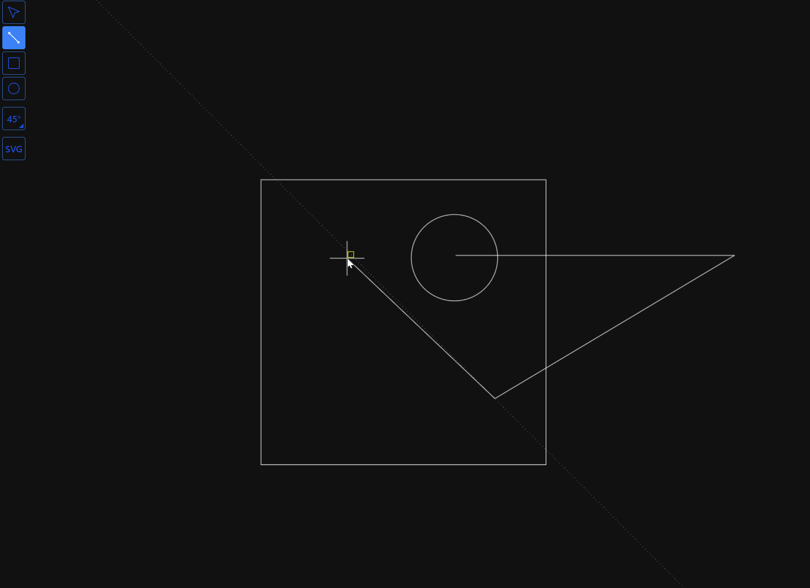

# Canvas Drawing Application

This is a React-based canvas drawing application that allows users to draw various shapes, such as lines, rectangles, and circles, on a fullscreen canvas. The application also includes features for selecting and erasing shapes, as well as exporting the drawing as an SVG file.



## Features

- Fullscreen canvas with a black background
- Drawing tools: Line, Rectangle, Circle
- Selection tool to highlight and modify shapes
  - Use CTRL to toggle selection
  - Use shift to add to the current selection
  - drag left, to select by intersecting
  - drag right, to select by containing
- Eraser tool to delete segments (TODO)
- Export drawing as an SVG file


## Technologies Used

- TypeScript
- JavaScript
- React
- NPM


## Demo
Visit https://bertyhell.github.io/openwebcad


## Installation

1. Clone the repository:
   ```sh
   git clone <repository-url>
   cd <repository-directory>
    ```
   
2. Install dependencies:
   ```sh
   npm install
   ```

## Usage
Start the development server:
    ```sh
    npm dev
    ```

Open your browser and navigate to http://localhost:5173


## Development
Available Scripts
* npm dev: Runs the app in development mode.
* npm run build: Builds the app for production.
* npm preview: Runs the production build in a local server.


## Project Structure
* src/: Contains the source code of the application.
* docs/: Contains the github pages site.
* public/: Contains assets that need to be accessible from the url. Like favicon.


## Contributing
Contributions are welcome! Please open an issue or submit a pull request for any changes.  


## License
This project is licensed under the MIT License.
